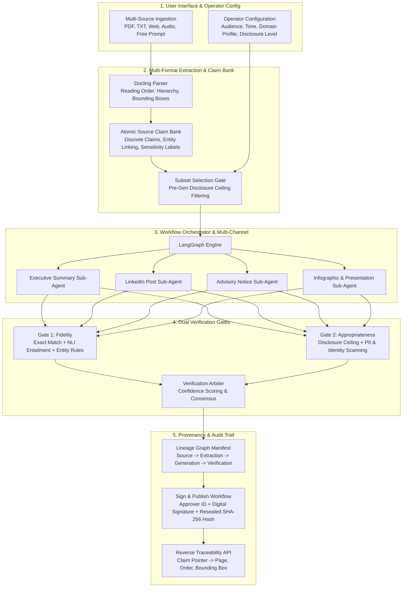

# Governed Content Transformation Platform

[](https://python.org)
[](https://fastapi.tiangolo.com)
[](https://langchain.com)
[](https://github.com/DS4SD/docling)
[](https://en.wikipedia.org/wiki/SHA-2)
[](https://react.dev)
[](tests/)

> *"Understand the source once. Govern the claims. Render across channels. Verify factual fidelity & appropriateness. Maintain cryptographic reverse traceability."*

---

## 🎯 Executive Summary & Core Paradigm

Modern enterprises and public organizations struggle with information distortion, unintended confidential leaks, and hallucinations when transforming complex reports into targeted communications (press releases, social threads, advisories, presentations).

This platform solves this through a zero-trust, governed pipeline:
1. **Source Once, Structure Forever:** Extracts documents (PDF, text, web, audio) into structural layouts, bounding boxes, and an indexed **Atomic Source Claim Bank**.
2. **Pre-Generation Governance:** Operator sets audience, tone, domain profile, and strict **Disclosure Ceilings** (`PUBLIC`, `INTERNAL`, `CONFIDENTIAL`, `RESTRICTED`). Unpermitted claims are gated out before the LLM ever sees them.
3. **Parallel Multi-Channel Rendering:** Dedicated sub-agent workflows synthesize targeted channels simultaneously from the exact same permitted claims.
4. **Dual Verification Gates:**
   - **Gate 1 (Fidelity):** Primary NLI Entailment + Secondary Entity/Numerical cross-check + Consensus Arbitration.
   - **Gate 2 (Appropriateness):** Policy engine scanning for disclosure violations and PII (Aadhaar, SSN, API secrets).
5. **Cryptographic Sign & Publish:** Produces a tamper-evident audit manifest sealed with a deterministic SHA-256 hash and approver signature.
6. **Reverse Traceability:** Every generated statement links back to source extraction block IDs, layout order, text spans, and exact **bounding box coordinates** `[x1, y1, x2, y2]`.

---

## 🏛 Technical Architecture



---

## ⚡ Key Modules & Capabilities

### 1. Multi-Format Extraction Layer (`extraction/`)
- **Docling Engine:** Extracts PDF, images, tables, and markdown with spatial coordinates, reading order, and document hierarchies.
- **Source Mapping:** Maintains a complete positional index with bounding boxes `[x1, y1, x2, y2]` and confidence scores.
- **Atomic Claim Layer (`extraction/services/claim_service.py`):** Decomposes extracted content into discrete statements, extracts numerical/currency entities, and tags sensitivity levels (`PUBLIC`, `INTERNAL`, `CONFIDENTIAL`, `RESTRICTED`).

### 2. Operator Configuration & Domain Profiles (`generation/`)
- **Operator Parameters:** Configures target audience, language, detail level, tone, and disclosure ceiling.
- **Formal Domain Profiles (`generation/services/domain_profiles.py`):**
  - `corporate`: Focus on clarity, stakeholder value, and public disclosure compliance.
  - `healthcare`: Strict patient privacy, clinical grounding, and empathetic tone.
  - `government`: Citizen accessibility, statutory compliance, and official transparency.
  - `disaster_response`: Actionable directives, emergency hotlines, and zero-ambiguity instructions.
  - `cybersecurity`: Operational security, threat indicator protection, and technical rigor.
- **Pre-Generation Gating:** Filters claim bank so restricted or confidential facts cannot reach the LLM context.

### 3. Parallel Multi-Channel Rendering (`generation/`)
- **Channel Endpoints (`POST /generate/channels`):** Concurrently synthesizes multiple target formats:
  - `executive_summary`
  - `linkedin_post`
  - `twitter_thread`
  - `advisory`
  - `infographic_brief`
  - `presentation_outline`
- **Free Prompt Mode:** Supports open-ended queries with ungrounded generation markers and explicit `["SYNTHETIC_MODEL_GENERATED"]` claim tags.

### 4. Dual Verification Gates (`dual_verification/`)
- **Gate 1 – Fidelity (Factual Grounding):**
  - **Primary Verifier:** NLI Entailment model verifying if source evidence strictly entails the claim statement.
  - **Secondary Verifier:** Deterministic entity cross-checker verifying that all numbers, dates, currencies, and percentages exactly match source evidence.
  - **Arbiter:** Resolves conflicts and calculates weighted confidence.
- **Gate 2 – Appropriateness (Compliance & Disclosure):**
  - Scans against operator disclosure ceiling (e.g. catches confidential project names or reserve figures).
  - PII scanners detect sensitive identifiers (Indian Aadhaar `\d{4}\s\d{4}\s\d{4}`, US SSN `\d{3}-\d{2}-\d{4}`, bearer/secret API tokens).

### 5. Provenance & Cryptographic Audit (`provenance/`)
- **Immutable Lineage Graph:** Connects `SourceNode` $\to$ `ExtractionNode` $\to$ `GenerationNode` $\to$ `VerificationNode`.
- **Integrity Seal:** Deterministic canonical JSON serialization hashed with SHA-256 (`compute_manifest_integrity_hash`).
- **Sign & Publish Workflow (`POST /provenance/{id}/publish`):** Transitions records to `PUBLISHED`, stamps approver ID and digital signature, and reseals the integrity hash.
- **Pinpoint Reverse Traceability (`GET /provenance/trace/{doc_id}/{block_id}`):** Traces generated claims back to exact source text, page number, reading order, and bounding box.

---

## 📡 API Reference Overview

| Method | Endpoint | Description |
|---|---|---|
| `POST` | `/extract` | Ingests raw text, document upload (PDF/TXT), or URL |
| `GET` | `/extract/{doc_id}` | Retrieves parsed document with source mapping & bounding boxes |
| `POST` | `/generate` | Executes single governed transformation workflow |
| `POST` | `/generate/channels` | Parallel multi-channel generation across selected channels |
| `POST` | `/verify` | Dual verification checking Gate 1 (Fidelity) and Gate 2 (Appropriateness) |
| `GET` | `/provenance/{id}` | Retrieves complete provenance manifest |
| `GET` | `/provenance/{id}/verify` | Cryptographically verifies manifest tamper-evidence |
| `POST` | `/provenance/{id}/publish` | Signs and reseals manifest for publication |
| `GET` | `/provenance/trace/{doc_id}/{block_id}` | Pinpoint reverse trace to source text & bounding box |

---

## 🧪 Verification & Automated Testing

The platform is backed by a 100% automated test suite with **95 passing tests**:

```bash
# Run complete test suite
pytest -v
```

```text
============================= test session starts =============================
platform win32 -- Python 3.10.2, pytest-9.1.1
collected 95 items

tests/test_api_endpoints.py .........................                    [ 26%]
tests/test_claim_service.py ....                                         [ 30%]
tests/test_operator_config.py .....                                      [ 35%]
tests/test_multi_channel_generation.py ....                              [ 39%]
tests/test_appropriateness_verifier.py ....                              [ 43%]
tests/test_publish_and_reverse_trace.py ....                             [ 47%]
tests/test_end_to_end_governance_pipeline.py .                           [ 48%]
...
============================= 95 passed in 8.47s ==============================
```

---

## 🚀 Quick Start Guide

### Prerequisites
- Python 3.10+
- Node.js 18+ and npm
- Ollama with `qwen3:8b` (optional for local LLM inference; mocked in test environments)

### 1. Backend Setup
```bash
# Activate virtual environment
.\.venv\Scripts\Activate.ps1  # Windows PowerShell
# or: source .venv/bin/activate  # Linux/macOS

# Install dependencies
pip install -r requirements.txt

# Run all verification tests
pytest

# Launch unified backend gateway
python main.py
```
*Unified API Gateway runs on `http://localhost:8000` with interactive Swagger docs at `http://localhost:8000/docs`.*

### 2. Frontend Setup
```bash
cd ui
npm install
npm run dev
```
*Frontend workspace will be live at `http://localhost:5173`.*
