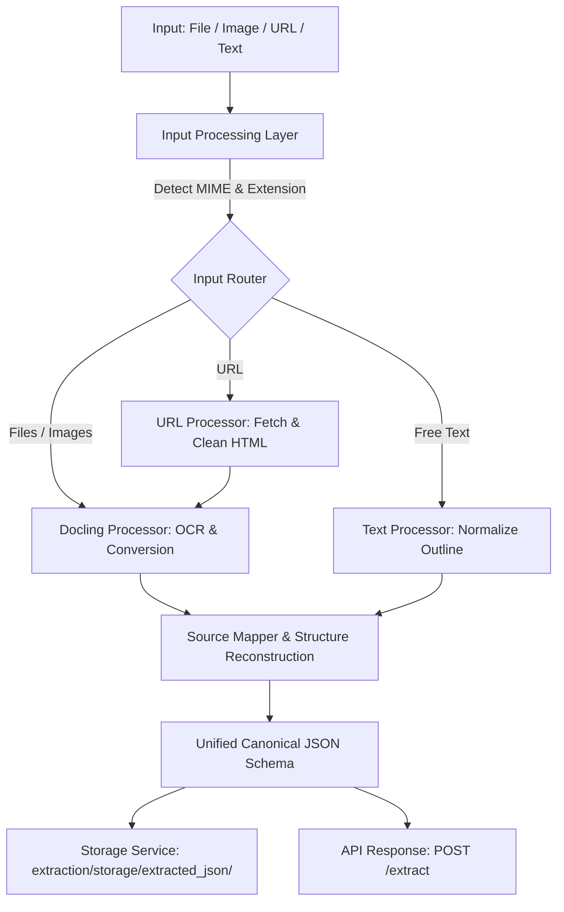

# Multi-Format Extraction Layer — Technical Design Specification (v1.0)

**Date**: 2026-09-25  
**Component**: Extraction Layer (Governed Content Transformation Platform)  
**Status**: Approved Specification  

---

## 1. Overview & Objectives

The **Multi-Format Extraction Layer** is the foundational ingestion engine of the Governed Content Transformation Platform. Its responsibility is to ingest multiple document types, extract rich structured content using **Docling** as the primary parsing engine, and produce a unified, traceable JSON representation.

### Key Objectives
- Accept and auto-detect multiple document formats (PDF, DOCX, TXT, Markdown, HTML, PNG, JPG, JPEG, URL, Free Text).
- Extract and preserve document hierarchy (H1, H2, H3), paragraphs, lists, tables, reading orders, and page references.
- Capture layout coordinates (bounding boxes) and extraction confidence for source mapping (traceability).
- Expose REST API endpoints (`POST /extract`, `GET /extract/{document_id}`) with consistent error handling.
- Persist extracted JSON artifacts locally in `extraction/storage/extracted_json/`.
- Ensure modularity so future components (Claim Layer, Verification Gates, Provenance) can consume the canonical schema without modifying extraction logic.

### Out of Scope (Version 1.0)
- Video & Audio processing
- Object detection / Video frame extraction
- Generative text transformation

---

## 2. Supported Formats & Ingestion Matrix

| Category | Format / Extension | Extraction Strategy |
|---|---|---|
| **Paged Documents** | PDF (`.pdf`) | Docling `DocumentConverter` with OCR & table structure |
| **Word Documents** | DOCX (`.docx`) | Docling native DOCX reader |
| **Structured Text** | HTML (`.html`), Markdown (`.md`), Plain Text (`.txt`) | Docling native parsing / markdown AST |
| **Images** | PNG (`.png`), JPG/JPEG (`.jpg`, `.jpeg`) | Docling DocumentConverter with OCR (`rapidocr` / built-in OCR) |
| **Web URLs** | HTTP / HTTPS URLs | `httpx` fetch + HTML readability cleanup -> Docling ingestion |
| **Free Text** | Raw string prompt | Text normalization into sections, paragraphs, reading order |

---

## 3. End-to-End Pipeline Architecture



---

## 4. Module Layout

The service lives inside [`extraction/`](file:///c:/Projects/PS2/extraction):

```
extraction/
├── api/
│   ├── __init__.py
│   ├── routes.py            # POST /extract, GET /extract/{document_id}
│   └── schemas.py           # API request/response schemas
├── processors/
│   ├── __init__.py
│   ├── docling_processor.py # Docling DocumentConverter (PDF, DOCX, Images with OCR)
│   ├── image_processor.py   # Image pre-validation and OCR delegation
│   ├── url_processor.py     # HTTP fetching, readability cleaning (BeautifulSoup)
│   └── text_processor.py    # Raw text / markdown structured normalization
├── models/
│   ├── __init__.py
│   └── extraction_models.py # Canonical Pydantic models (Document, Section, Table, SourceMapping)
├── services/
│   ├── __init__.py
│   ├── extraction_service.py # Orchestrator coordinating detector, processors, and storage
│   └── storage_service.py   # Local filesystem JSON storage manager
├── utils/
│   ├── __init__.py
│   ├── file_detector.py     # MIME sniffing, extension validation, unique doc ID generation
│   ├── metadata.py          # Metadata builders (pages, timestamps, language)
│   └── source_mapper.py     # Node item traversal -> canonical hierarchy & source mappings
├── storage/
│   └── extracted_json/      # JSON output persistence directory
├── main.py                  # FastAPI application entry point, CORS, and exception handlers
└── requirements.txt         # Dependencies specification
```

---

## 5. Canonical Data Contracts

### Unified Document Schema
```json
{
  "document_id": "doc_8fd2a1c0",
  "source_type": "pdf",
  "metadata": {
    "filename": "Annual_Report.pdf",
    "pages": 18,
    "language": "en",
    "processed_at": "2026-09-25T10:30:00Z"
  },
  "content": {
    "hierarchy": [
      { "level": 1, "title": "Executive Summary", "page": 1 },
      { "level": 2, "title": "Financial Highlights", "page": 2 }
    ],
    "sections": [
      { "title": "Executive Summary", "page": 1, "paragraph_ids": ["p_0", "p_1"] }
    ],
    "tables": [
      {
        "page": 2,
        "rows": 3,
        "columns": 2,
        "cell_values": [
          ["Product", "Revenue"],
          ["Product A", "$500M"],
          ["Product B", "$700M"]
        ]
      }
    ],
    "paragraphs": [
      {
        "id": "p_0",
        "text": "This report details company performance across Q1-Q4.",
        "page": 1,
        "section": "Executive Summary",
        "reading_order": 0
      }
    ]
  },
  "source_mapping": [
    {
      "id": "block_0",
      "page": 1,
      "section": "Executive Summary",
      "reading_order": 0,
      "bounding_box": [30.0, 120.0, 500.0, 45.0],
      "confidence": 0.98,
      "source_pointer": "doc_8fd2a1c0#p_0"
    }
  ]
}
```

---

## 6. REST API Design

### 1. `POST /extract`
- **Request Content-Type**: `multipart/form-data`
  - `file`: (Optional) Uploaded document file (`.pdf`, `.docx`, `.txt`, `.md`, `.html`, `.png`, `.jpg`, `.jpeg`)
  - `url`: (Optional) Webpage URL to fetch and extract
  - `text`: (Optional) Raw free-text or markdown string
- **Validation**: At least one of `file`, `url`, or `text` must be provided.
- **Success Response (200 OK)**: Returns the complete canonical extraction result and extraction status.

### 2. `GET /extract/{document_id}`
- **Path Parameter**: `document_id` (e.g., `doc_8fd2a1c0`)
- **Success Response (200 OK)**: Returns previously persisted JSON extraction artifact.
- **Error Response (404 Not Found)**:
  ```json
  { "status": "error", "message": "Document doc_8fd2a1c0 not found." }
  ```

### 3. Error Contract
Standardized JSON responses for all error conditions:
- `400 Bad Request`: Unsupported file type, missing parameters, invalid URL.
- `422 Unprocessable Entity`: Corrupted or unparseable document file.
- `404 Not Found`: Requested document ID does not exist in storage.
- `500 Internal Server Error`: Extraction engine failure with descriptive message.

---

## 7. Verification & Testing Strategy
1. **Unit Tests**:
   - `test_file_detector.py`: MIME type detection and unsupported format rejections.
   - `test_text_processor.py`: Free-text and markdown heading/paragraph structure extraction.
   - `test_source_mapper.py`: Coordinate and reading order extraction verification.
2. **Integration Tests**:
   - `POST /extract` with text content.
   - `POST /extract` with mock/sample PDF and image files.
   - `GET /extract/{document_id}` retrieval and 404 behavior.
