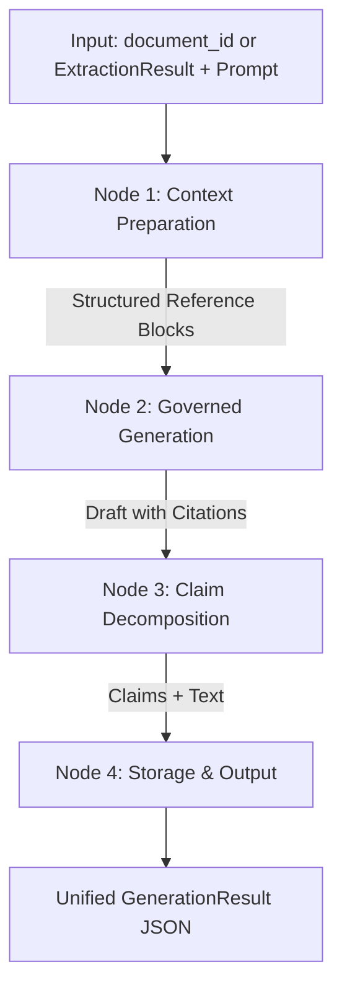

# Governed Generation Layer — Technical Design Specification (v1.0)

**Date**: 2026-09-25  
**Component**: Generation Layer (Governed Content Transformation Platform)  
**Status**: Approved Specification  

---

## 1. Overview & Objectives

The **Governed Generation Layer** is the second core subsystem of the platform. It consumes the structured JSON produced by the **Multi-Format Extraction Layer** and uses **LangGraph** with a local **Ollama** instance (`qwen3:8b`) to produce governed, grounded transformations (e.g. summaries, reports, translated formats, policy briefs) with verifiable claims linked to source pointers.

### Key Objectives
- **Extraction Coupling**: Seamlessly ingest either a `document_id` (retrieving the JSON from `extraction/storage/extracted_json/`) or a raw `ExtractionResult` payload.
- **Governed Prompting**: Instruct `qwen3:8b` to execute the user's transformation instruction while adhering to governance constraints (e.g. strict grounding, no speculative claims, explicit citation of source blocks).
- **Claim Decomposition**: Automatically decompose the generated transformation into discrete factual claims mapped to original `source_pointer` identifiers (`doc_xxx#p_0`), creating the primary input for the downstream **Dual Verification Layer**.
- **LangGraph Orchestration**: Manage the pipeline as a transparent, modular state graph.
- **REST Endpoints & Storage**: Expose `POST /generate` and `GET /generate/{generation_id}`, persisting generation artifacts to `generation/storage/generated_content/`.

---

## 2. Pipeline & LangGraph Workflow



### LangGraph State Schema (`GenerationState`)
```python
class GenerationState(TypedDict):
    generation_id: str
    document_id: str
    extraction_data: Dict[str, Any]
    instruction: str
    guidelines: List[str]
    context_blocks: str
    generated_text: str
    claims: List[Dict[str, Any]]
    error: Optional[str]
```

### Graph Nodes
1. **`prepare_context_node`**: Traverses `content.paragraphs` and `content.tables` from the extraction result, building a numbered context string where each block is tagged with its `source_pointer` (e.g. `[doc_123#p_0] Text...`).
2. **`governed_generate_node`**: Invokes Ollama `qwen3:8b` with a system prompt requiring grounding in the provided context blocks and citation of source pointer tags `[doc_xxx#p_0]`.
3. **`decompose_claims_node`**: Extracts atomic claims from the generated text and pairs each claim with the cited source pointers.
4. **`persist_result_node`**: Serializes the `GenerationResult` and saves it to `generation/storage/generated_content/{generation_id}.json`.

---

## 3. Module Layout

The service lives inside [`generation/`](file:///c:/Projects/PS2/generation):

```
generation/
├── api/
│   ├── __init__.py
│   ├── routes.py            # POST /generate, GET /generate/{generation_id}
│   └── schemas.py           # GenerationRequest, GenerationAPIResponse
├── graph/
│   ├── __init__.py
│   ├── state.py             # TypedDict GenerationState
│   ├── nodes.py             # Graph node implementations
│   └── workflow.py          # StateGraph assembly & compilation
├── models/
│   ├── __init__.py
│   └── generation_models.py # ClaimItem, GenerationMetadata, GenerationResult
├── services/
│   ├── __init__.py
│   ├── ollama_client.py     # Ollama client wrapper with model fallback & prompts
│   ├── generation_service.py # Orchestrator bridging Extraction storage & LangGraph
│   └── storage_service.py   # Persists and retrieves generated JSON artifacts
├── storage/
│   └── generated_content/   # Stored JSON generation artifacts
└── main.py                  # Standalone FastAPI service / router exporter
```

---

## 4. Canonical Data Contracts

### 1. Request Contract (`POST /generate`)
```json
{
  "document_id": "doc_8fd2a1c0",
  "instruction": "Summarize the key financial highlights and revenue drivers.",
  "guidelines": [
    "Ground all statements strictly in the extracted document.",
    "Do not extrapolate or speculate on unmentioned figures."
  ]
}
```

### 2. Output Contract (`GenerationResult`)
```json
{
  "generation_id": "gen_7e2a9b1c",
  "document_id": "doc_8fd2a1c0",
  "instruction": "Summarize the key financial highlights and revenue drivers.",
  "generated_text": "In FY2025, company revenue grew by 20% to $500M [doc_8fd2a1c0#p_0]. Operating expenses remained stable [doc_8fd2a1c0#p_1].",
  "claims": [
    {
      "claim_id": "claim_0",
      "statement": "Company revenue grew by 20% to $500M in FY2025.",
      "cited_source_pointers": ["doc_8fd2a1c0#p_0"]
    },
    {
      "claim_id": "claim_1",
      "statement": "Operating expenses remained stable.",
      "cited_source_pointers": ["doc_8fd2a1c0#p_1"]
    }
  ],
  "metadata": {
    "model": "qwen3:8b",
    "claim_count": 2,
    "generated_at": "2026-09-25T11:30:00Z"
  }
}
```

---

## 5. REST API Endpoints

1. **`POST /generate`**
   - Body: `GenerationRequest` (JSON)
   - Status 200: Returns `GenerationAPIResponse` containing `generation_id`, `status: "success"`, and the full `GenerationResult`.
   - Status 400: Missing document_id / extraction_data or missing instruction.
   - Status 404: Specified `document_id` not found in extraction storage.
   - Status 500: Ollama connection or inference error.

2. **`GET /generate/{generation_id}`**
   - Path param: `generation_id`
   - Status 200: Returns stored `GenerationResult`.
   - Status 404: Generation ID not found.

---

## 6. Verification Strategy
1. **Unit Tests**:
   - `test_context_builder.py`: Validates reference block formatting and source pointer tagging.
   - `test_claim_decomposition.py`: Validates parsing of statements and extraction of cited source pointers.
   - `test_generation_storage.py`: Validates saving and retrieval of `GenerationResult`.
2. **Integration Tests**:
   - `test_langgraph_workflow.py`: End-to-end execution of `StateGraph` with mock Ollama response.
   - `test_generation_api.py`: FastAPI endpoint tests for `POST /generate` and `GET /generate/{generation_id}`.
